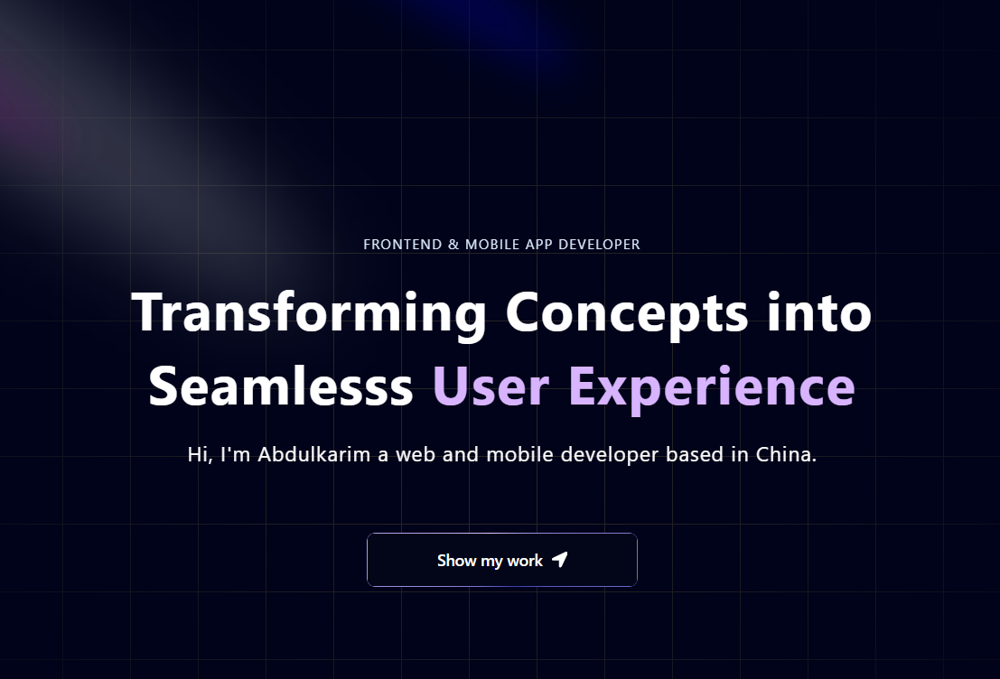

<!-- HERO IMAGE -->

  

<h1 align="center">Abdulkarim Umar</h1>

  <strong>Frontend & Mobile App Developer</strong> 
  Transforming concepts into seamless user experiences

  
  
  
  

---

## 👋 About Me

Hi, I’m **Abdulkarim**, a **frontend and mobile app developer** based in China.  
I build modern, responsive web and mobile applications with a strong focus on **user experience, performance, and clean architecture**.

I enjoy turning ideas into real products using modern JavaScript technologies and continuously improving my skills through hands-on projects and teamwork.

---

## 🛠 Tech Stack

### 🌐 Web
- React  
- Next.js  
- TypeScript  
- Tailwind CSS  

### 📱 Mobile
- React Native 
- Expo 

### 🧰 Tools & Platforms
- Git & GitHub  
- Docker (basic)  
- REST APIs  
- PostgreSQL / MySQL 
- MongoDB

---

## 🚀 Features of This Portfolio

- Responsive and modern UI
- Smooth animations and interactions
- Project showcase with real-world examples
- Testimonials and experience sections
- Clean, scalable component structure

---

## 📂 Projects

This portfolio showcases:
- Web applications built with **React & Next.js**
- Mobile apps built with **React Native**
- UI-focused projects with real functionality
- Team-based and independent development work

👉 Check the **Projects** section on the website for live demos and repositories.

---

## 🤝 Team & Collaboration Experience

- Worked on **team-based projects**, collaborating on features and UI consistency
- Participated in planning, implementation, debugging, and integration
- Comfortable working with shared codebases and version control

---

## 📫 Contact

- GitHub: https://github.com/SecureAuditX   
- Email: **abdulkarimumar86@gmail.com**

---

## 📄 License

This project is licensed under the **MIT License**.  
Feel free to explore, learn from, and get inspired by the code.

---

  <strong>⭐ If you like this portfolio, consider giving it a star!</strong>

